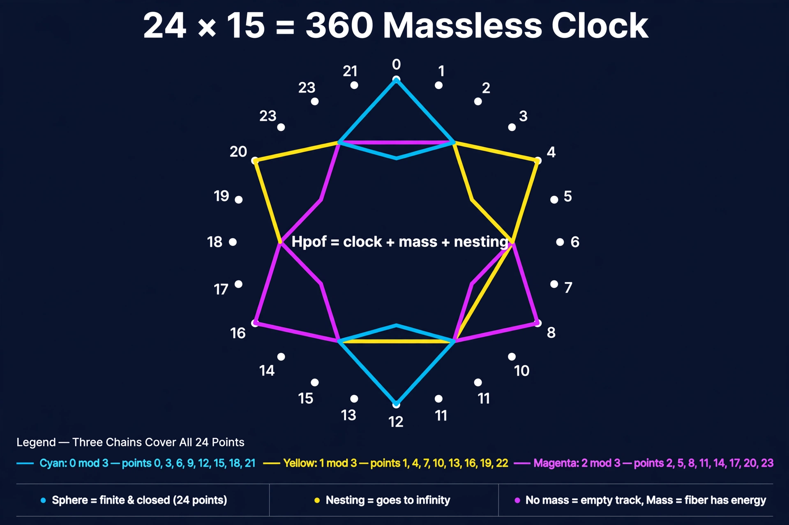

# Hpof - 24×15=360 Massless Clock → Gas Giant

Your math only. No other stack. Whole numbers you can't break.



## The idea

* **Clock = Fin 24** - 24 marks, 15° each, 360° total
* **+3 step** - 8 steps closes: `iter 8 k = k` (`by decide`)
* **3 chains cover all 24** - 0 mod 3, 1 mod 3, 2 mod 3
* **Sphere = finite & closed** - 24 points at fixed radius `r`
* **Nesting = goes to infinity** - `R` spheres stacked, not one sphere stretching
* **Fibers = Air or Nitrogen** - mass gives energy, no mass = empty track

```
Hpof = clock + mass + nesting
```

## Gas giant version

Before: fiber was just a track.
Now: fiber has material.

```lean
def AirShell (r : Nat) : Shell := { r := r, mass := 1 }
def NitrogenShell (r : Nat) : Shell := { r := r, mass := 2 }

def Energy (s : Shell) : Nat := s.mass * s.r * s.r

theorem air_has_energy (r) (hr : 0 < r) : 0 < Energy (AirShell r)
theorem nitrogen_has_energy (r) (hr : 0 < r) : 0 < Energy (NitrogenShell r)
```

Air = mass 1, Nitrogen = mass 2, both give `m * r² > 0`. Layer them → gas giant.

## What Lean checks (all green, bare Lean 4, no Mathlib)

* `deg_lt_360` - every mark <360
* `iter8_closes` - 8 steps +3 mod 24 = home
* `three_chains_cover`
* `energy_zero_iff_mass_zero : Energy = 0 ↔ mass = 0` when `r>0` - proven with `Nat.mul_eq_zero.mp`, not by definition
* `mass_pos_gives_energy : mass>0 → Energy>0` - `Nat.mul_pos`
* `fiber_in_shell`, `fibers_disjoint : r1≠r2 → Fiber r1 ∩ Fiber r2 = ∅` - spherical certainty
* `sphere_finite : (Sphere s).length = 24` - `by rfl` (fixed from `by decide` +revert error)
* `hpof_always_closed`

## Build

```bash
lake build
-- or just
lean Hpof.lean
```

No `omega`, no `Mathlib`, no `sorry`. Just `decide`, `rfl`, `simp`.

## Files

* `Hpof.lean` - V3 GREEN FINAL - the locked file that compiles
* `clock.png` - 24×15=360 massless clock, 3 chains, Hpof = clock + mass + nesting

## History

V1: massless clock, 24×15=360, almost all green
V2: locked with `Energy = m * r²`, no Bool trick
V3: fixed `Expected type must not contain free variables` → `sphere_finite by rfl`, `air_has_energy by Nat.mul_pos`, added Air/Nitrogen → gas giant

Bingo.
